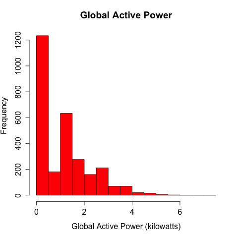
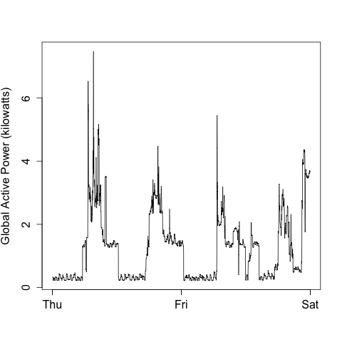
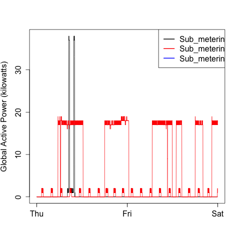
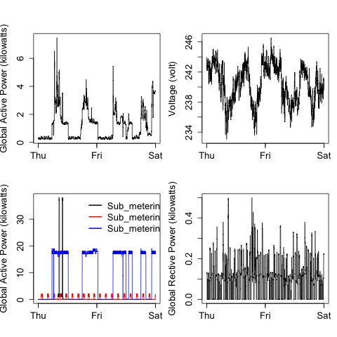

## Introduction
This is to complete the class assignment for "Exploratory Data Analysis". 

To follow the assignment scripts, you need to 
downlaod the file from the class assignment page
* <b>Dataset</b>: <a href="https://d396qusza40orc.cloudfront.net/exdata%2Fdata%2Fhousehold_power_consumption.zip">Electric power consumption</a> [20Mb]

* <b>Description</b>:
* Download the file
* Unzip the file.
* Navigate to the folder where the unzipped file is saved
* follow the steps from the respective plotX.R file to create plots for the assignment.

### Plot 1

 

### Plot 2

 

### Plot 3

 

### Plot 4

 

